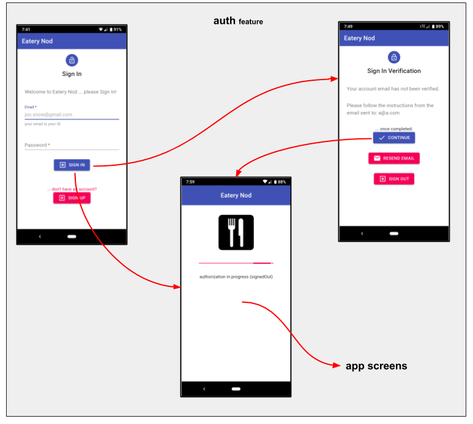

# eatery-nod-w

## Overview

**eatery-nod-w** is **Date Night Restaurant Selector** ... a web-app
**that randomly selects a "date night" restaurant from a pool of
favorites**.  In other words, it gives a **nod** to an **eatery**
(_geeks need to have fun somehow_ :-)

My wife and I have a steady "date night" (with another couple) and we
are always indecisive on which of our favorite restaurants to
frequent, so **eatery-nod-w** provides the spinning wheel!

**eatery-nod-w** is a web-based [PWA] rendition of the [eatery-nod]
**react-native expo mobile app**.


## At a Glance

- [Overview]
  - [Eatery Pool]
  - [Discovery]
  - [Authorization]
  - [Responsive Design]
- [Running the App]
  - [From Deployment]
  - [From Source]
- [Technical]
  - [Feature Based Development]
  - [React Hooks]
  - [Dependencies]
    - [Runtime Stack]
    - [Tooling]
    - [Deployment]
  - [NPM Scripts]
- [Revision History]
  - [v2.2.0] - _**Better Async Initialization** (July xx, 2019)_
  - [v2.1.0] - _**Responsive Design** (June 07, 2019)_
  - [v2.0.0] - _**React Hooks** (May 10, 2019)_
  - [v1.0.0] - _**Initial Release** (May 05, 2019)_


## Eatery Pool

The main screen of eatery-nod is the **Eatery Pool** (_please refer to
the [eateries feature](src/features/eateries)_).

This visualizes your persistent pool of restaurants to select from
(the list can optionally be filtered).

You can select a restaurant directly, or "spin" for a random
selection.

The "detailed" view provides direct communication to the establishment
(phone them, visit their web site, or navigate to their address).


## Discovery

Your pool of eateries is maintained through **Discovery** (_please
refer to the [discovery feature](src/features/discovery)_).

You don't have to maintain the details of your pool by hand.  Rather,
you simply search the restaurants using the **discovery** feature.
This is the same source that is used when you issue a Google Search
(based on [Google Places](https://developers.google.com/places/)).

Within the discovery view, you simply toggle the check next to the
entry.  **Red** entries are in your pool, **Grey** entries are not.


## Authorization

Authorization is provided through the [auth
feature](src/features/common/auth), requiring a validated email/password
before promoting any application screens.




## Responsive Design

**eatery-nod-w** employs a **Responsive Design** where web pages
render well on a variety of devices and window or screen sizes
(desktops, cell phones, tablets, etc.).

As an example, here is the eatery pool shown on a **cell phone**:

<p align="center"></p>

And here is the same screen manifest on a **desktop browser**:

<p align="center"></p>

For more information, see [baseUI Responsive Design].


## Running the App

You can run **eatery-nod-w** in one of two ways: [From Deployment], or
[From Source]:


## From Deployment

You can play with **eatery-nod-w** immediately through it's production
deployment site: https://eatery-nod-w.js.org/

Currently the sign-in process has **"locked down" account creation**,
because of the limited resources of the free Google Firebase account.
However you can **use a "Guest ID"** that will morph the environment
into your own "mocked" in-memory data source (that doesn't utilize
Firebase).

<ul> <!--- indentation hack --->

Simply use an email id that begins with `guestNO@` (ex:
`guestNO@myDomain.com`), with a password of `guestNO`.

</ul>

When using a "Guest ID", remember the following:
- Your GPS location will be morphed to New Orleans.
- Your Eateries pool is morphed into an in-memory DB.
- Your Discovery view is live, searching real eateries in New Orleans.
- You can add entries to your pool (from the discovery view), but
  remember that your pool is an in-memory DB ... so if you refresh the site,
  it will revert back to the initial in-memory DB image.


## From Source

If you wish to run **eatery-nod-w** from your local machine _(where
you can make changes)_, follow these instructions:

1. Clone _(or zip)_ the git repo to your local machine.

2. Initialize the project:
   ```
   $ cd {project-root}
   $ npm install  # install project dependencies
   ```

3. Setup the services ... _you have two choices_:

   - **Using Mock Services**

     The easiest way play with the project is to use the mock
     services.  This means you don't have any setup for the back-end
     service credentials or the DB configuration _(retaining the pool
     entries)_.

     To enable the mock services, simply make the following settings
     in [`src/featureFlags.js`](src/featureFlags.js):

     ```js
     useWIFI: false,                             // use mock service
     mockGPS: {lat: 30.010479, lng: -90.119414}, // simulate New Orleans GPS location
     ```

   - **Using Real Services**

     eatery-nod uses two Google cloud services: 
       - firebase (for authorization and the eatery pool DB)
       - google places (for the discovery)

     **Define Service Credentials**

     You must establish your own credentials for these services ... see:
     - [initFirebase]
     - [initGooglePlaces]

     **Define DB Schema**

     The **userProfiles** and **pools** are maintained in a persistent Firebase DB.
     You must establish the following DB schema in your firebase account:

     ```js
     eatery-nod: {
       userProfiles: {
         // ... login profiles
         //     NOTE: these entries are maintained by eatery-nod-w code!
         //           You just need to define the parent structure (in your schema)!!
         //           For completeness, here is an example:
         dbcatrem2PwyWgLJciViS7q0szg2: {
           name: "Kevin",
           pool: "Date Night",
         },
       },
       pools: {
         // ... pool entry points, cataloged by userProfile.{user-id}.pool
         //     NOTE: these entries are maintained by eatery-nod-w code!
         //           You just need to define the parent structure (in your schema)!!
         //           For completeness, here is an example:
         "Date Night": {
           ChIJ1Wb6nh76dYgRbFqImosN0to: {
             id:   "ChIJ1Wb6nh76dYgRbFqImosN0to",
             name: "Andria's Countryside Restaurant",
             addr: "7415 IL-143, Edwardsville, IL 62025, USA",
             loc: {
               lat: 38.8035556,
               lng: -89.9180782,
             },
             navUrl:  "https://maps.google.com/?cid=15767680138621770348",
             phone:   "(618) 656-0281",
             website: "http://www.andriascountryside.com/",
           },
           // ... more pool entries here
         }
       },
     }
     ```

4. Start your dev server, launching the app at http://localhost:3000
   ```
   $ npm start
   ```


## Technical

The technical details about the **eatery-nod-w** application can be
found here.

**eatery-nod-w** is a web-based [PWA] rendition of the [eatery-nod]
**react-native expo mobile app**.

The tooling for **eatery-nod-w** is maintained through [Create React
App].


## Feature Based Development

The implementation of **eatery-nod-w** employs **features** through a
utility called **[feature-u]**, that facilitates **feature-based
solutions**, making it's features truly **plug-and-play**!

**Feature Based Development** greatly improves code comprehension,
because there is a direct correlation between the **problem space**
_(or requirements)_ and the **implementation** _(the code)_!

This approach scales better, making the code easier to maintain,
because the modules _(or features)_ are smaller and more focused.
When features are **plug-and-play**, the application is in essence
broken up into several mini-apps _(so to speak)_.

Here is a complete list of [**eatery-nod-w**
features](src/features/README.md).

You can find more information about **[feature-u]** here:

- **[feature-u teaser]**
- **[feature-u article]**
- **[feature-u docs]**
- **[feature-u repo]**


## React Hooks

This project uses the [React] UI Framework _(maintained by Facebook)_,
and employs it's latest and **most exciting feature called [Hooks]**.

**Hooks** allow you to **"hook into"** React state and lifecycle
aspects _from functional components_.  They greatly simplify the UI
implementation _over the alternative of Higher Order Components
([HoC])_.

Here is a [before/after
hooks](https://github.com/KevinAst/eatery-nod-w/compare/beforeHooks...afterHooks)
source comparison for this project.


## Dependencies

In case your wondering what all those dependencies are in
`package.json`, here is a run-down:

### Runtime Stack

<ul> <!--- indentation hack --->

The runtime stack used by **eatery-nod** is:

- [React]: the UI framework
  `"react", "react-dom"`

- [Material-UI](https://material-ui.com/): the UI component library
  `"@material-ui/core", "@material-ui/icons"`

  - [notistack](https://github.com/iamhosseindhv/notistack): extension to Material-UI Snackbar
    `"notistack"`

- [feature-u]: facilitates feature-based solutions
  `"feature-u", "feature-redux", "feature-redux-logic", "feature-router"`

- [redux](https://redux.js.org/): the application state manager
  `"redux", "react-redux"`

  _misc redux utils:_

  - [action-u](https://action-u.js.org/): redux action creator and organization
    `"action-u"`

  - [astx-redux-util](https://astx-redux-util.js.org/): redux reducer composition utilities
    `"astx-redux-util"`

  - [reselect](https://github.com/reduxjs/reselect): selector library for Redux
    `"reselect"`

- [redux-logic](https://github.com/jeffbski/redux-logic): organizes business logic
  `"redux-logic"`

- [Firebase](https://github.com/firebase/firebase-js-sdk): Google Firebase SDK
  `"firebase"`

- _misc general utils:_

  - [lodash](https://lodash.com/): JS utils
    `"lodash.isequal", "lodash.isfunction", "lodash.isplainobject", "lodash.isstring"`

  - [geodist](https://github.com/cmoncrief/geodist): geographical distance calculator
    `"geodist"`

  - [yup](https://github.com/jquense/yup): JS object schema validator
    `"yup"` _(used by the [iForms util](src/util/iForms))_

</ul>


### Tooling

<ul> <!--- indentation hack --->

- [Create React App]: project tooling `"react-scripts"`

</ul>


### Deployment

<ul> <!--- indentation hack --->

- [GitHub Pages](https://pages.github.com/): project deployment
  `"gh-pages"`

</ul>


## NPM Scripts

The following NPM Scripts are available:

```
DEVELOPMENT
===========

start ..... runs the app in development mode (http://localhost:3000)
            - the page will reload when edits are applied
            - the console will show any lint errors

TESTING
=======

test ...... launches the test runner in an interactive watch mode


CODE QUALITY
============

lint ...... verify code quality, linting BOTH production and test code
            - real-time linting is ALSO applied within VSCode
            - the console will also show any lint errors


DEPLOYMENT
==========

build ..... builds app for production (in the build/ directory)

deploy .... deploy the app (to: https://eatery-nod-w.js.org/)
            NOTE: this script automatically runs the "build" script
                  (via the "predeploy" script)


MISC
====

eject ..... eject the Create React App project tooling
            NOTE: This is a one-way operation!
                  Once you eject, you can’t go back!
            NOTE: This script has been removed,  so as to 
                  AVOID accidental activation
                  ... easy to do with VSCode tasks
                  THE SCRIPT IS:
                  "eject": "react-scripts eject"
```


## Revision History


Release  | What                                            | *When*
---------|-------------------------------------------------|------------------
[v2.2.0] | Better Async Initialization                     | *July xx, 2019*
[v2.1.0] | Responsive Design                               | *June 07, 2019*
[v2.0.0] | React Hooks                                     | *May 10, 2019*
[v1.0.0] | Initial Release                                 | *May 05, 2019*


<!-- *** RELEASE *************************************************************** -->

### v2.2.0 - Better Async Initialization *(July xx, 2019)*

<ul><ul> <!--- indentation hack --->

[GitHub Content](https://github.com/KevinAst/eatery-nod-w/tree/v2.2.0)
&bull;
[GitHub Release](https://github.com/KevinAst/eatery-nod-w/releases/tag/v2.2.0)
&bull;
[Diff](https://github.com/KevinAst/eatery-nod-w/compare/v2.1.0...v2.2.0)

**Technical:**

- The `bootstrap` feature was replaced with **feature-u**'s new
  `Feature.appInit()` Application Life Cycle Hook _(supporting blocking
  async initialization)_.

  ?? MORE: anything else?

</ul></ul>


<!-- *** RELEASE *************************************************************** -->

### v2.1.0 - Responsive Design *(June 07, 2019)*

<ul><ul> <!--- indentation hack --->

[GitHub Content](https://github.com/KevinAst/eatery-nod-w/tree/v2.1.0)
&bull;
[GitHub Release](https://github.com/KevinAst/eatery-nod-w/releases/tag/v2.1.0)
&bull;
[Diff](https://github.com/KevinAst/eatery-nod-w/compare/v2.0.0...v2.1.0)

**General:**

- The Eateries List screen has changed as follows:

  - It is now **responsive**, adjusting the original cell-phone list
    to a more detailed table when enough device real estate is
    available _(see [Responsive Design])_.

  - When pool entries are sorted by distance:

    - the mileage divider is now more visually distinct _(using
      color)_

    - eatery name is used as a secondary sort field (within the same
      distance)

- A user-selectable **responsive boundary** is promoted through the
  [User Menu], defining where additional screen content can be
  manifest _(based on the screen width)_.  For more information, see
  [baseUI Responsive Design].

- Distance (mileage) is now visible in the Eatery Detail screen.

<!--- hack to push title down WITHIN ul --->
&nbsp;

**Docs:**

- Added a complete [Running the App] section that describes how you
  can run **eatery-nod-w** and/or setup the project in your local
  environment.

- All screen prints now reflect this web app _(retrofitted from the
  eatery-nod react-native expo app)_.

<!--- hack to push title down WITHIN ul --->
&nbsp;

**Technical:**

- The API Credentials have been decoupled from the common "init"
  feature packages, by accessing them from the deployed server (see
  features: [initFirebase] and [initGooglePlaces]).

- The Material-UI library was upgraded to V4, replacing **ALL**
  remaining HOCs with **React Hooks**!

- Upgraded to React V16.8.6.

- Define a set of reusable custom hooks, which maintains responsive
  breakpoints (based on consistent media queries) ... see:
  [`src/util/responsiveBreakpoints.js`](src/util/responsiveBreakpoints.js)

</ul></ul>


<!-- *** RELEASE *************************************************************** -->

### v2.0.0 - React Hooks *(May 10, 2019)*

<ul><ul> <!--- indentation hack --->

[GitHub Content](https://github.com/KevinAst/eatery-nod-w/tree/v2.0.0)
&bull;
[GitHub Release](https://github.com/KevinAst/eatery-nod-w/releases/tag/v2.0.0)
&bull;
[Diff](https://github.com/KevinAst/eatery-nod-w/compare/v1.0.0...v2.0.0)

**Technical:**

- React [Hooks] are now used in place of Higher Order Components
  ([HoC]) ... read about it [here](#react-hooks).

- The [baseUI] feature now **sorts selected menu items by key**,
  giving complete control over the order in which they appear,
  irrespective of feature-expansion order.  This includes the **use
  contracts** for:
  - [Left Nav]
  - [User Menu]

</ul></ul>


<!-- *** RELEASE *************************************************************** -->

### v1.0.0 - Initial Release *(May 05, 2019)*

<ul><ul> <!--- indentation hack --->

[GitHub Content](https://github.com/KevinAst/eatery-nod-w/tree/v1.0.0)
&bull;
[GitHub Release](https://github.com/KevinAst/eatery-nod-w/releases/tag/v1.0.0)
<!-- Diff ONLY for subsequent releases
&bull;
[Diff](https://github.com/KevinAst/eatery-nod-w/compare/v1.0.0...v1.0.1)
-->

**General:**

- This represents the initial port of this [PWA], from the
  [eatery-nod] react-native expo mobile app.

</ul></ul>


<!--- *** REFERENCE LINKS *** ---> 

[Overview]:                  #overview
[Eatery Pool]:               #eatery-pool
[Discovery]:                 #discovery
[Authorization]:             #authorization
[Responsive Design]:         #responsive-design


[Running the App]:           #running-the-app
[From Deployment]:           #from-deployment
[From Source]:               #from-source

[Technical]:                 #technical
[Feature Based Development]: #feature-based-development
[React Hooks]:               #react-hooks
[Dependencies]:              #dependencies
[Runtime Stack]:             #runtime-stack
[Tooling]:                   #tooling
[Deployment]:                #deployment

[NPM Scripts]:               #npm-scripts

[Revision History]:    #revision-history
 [v2.2.0]:             #v220---better-async-initialization-july-xx-2019
 [v2.1.0]:             #v210---responsive-design-june-07-2019
 [v2.0.0]:             #v200---react-hooks-may-10-2019
 [v1.0.0]:             #v100---initial-release-may-05-2019


[baseUI]:                    src/features/common/baseUI/README.md
[Left Nav]:                  src/features/common/baseUI/README.md#left-nav
[User Menu]:                 src/features/common/baseUI/README.md#user-menu
[baseUI Responsive Design]:  src/features/common/baseUI/README.md#responsive-design

[initFirebase]:              src/features/common/initFirebase/README.md
[initGooglePlaces]:          src/features/common/initGooglePlaces/README.md

[React]:                     https://reactjs.org/
[HoC]:                       https://reactjs.org/docs/higher-order-components.html
[Hooks]:                     https://reactjs.org/docs/hooks-overview.html
[Create React App]:          https://facebook.github.io/create-react-app/

[feature-u]:                 https://feature-u.js.org/
[feature-u teaser]:          http://bit.ly/feature-u-teaser
[feature-u article]:         http://bit.ly/feature-u-article
[feature-u docs]:            https://feature-u.js.org/
[feature-u repo]:            https://github.com/KevinAst/feature-u

[PWA]:                       https://developers.google.com/web/progressive-web-apps/
[eatery-nod]:                https://github.com/KevinAst/eatery-nod

