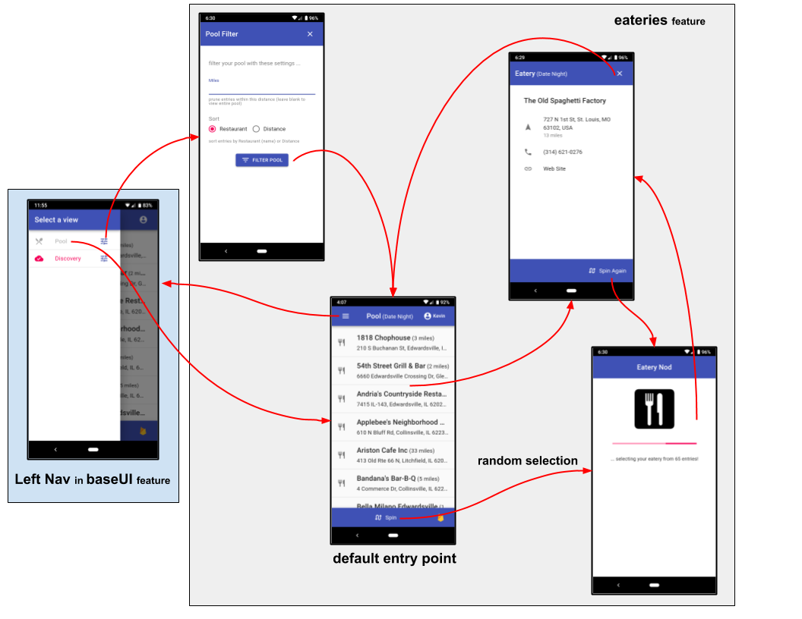
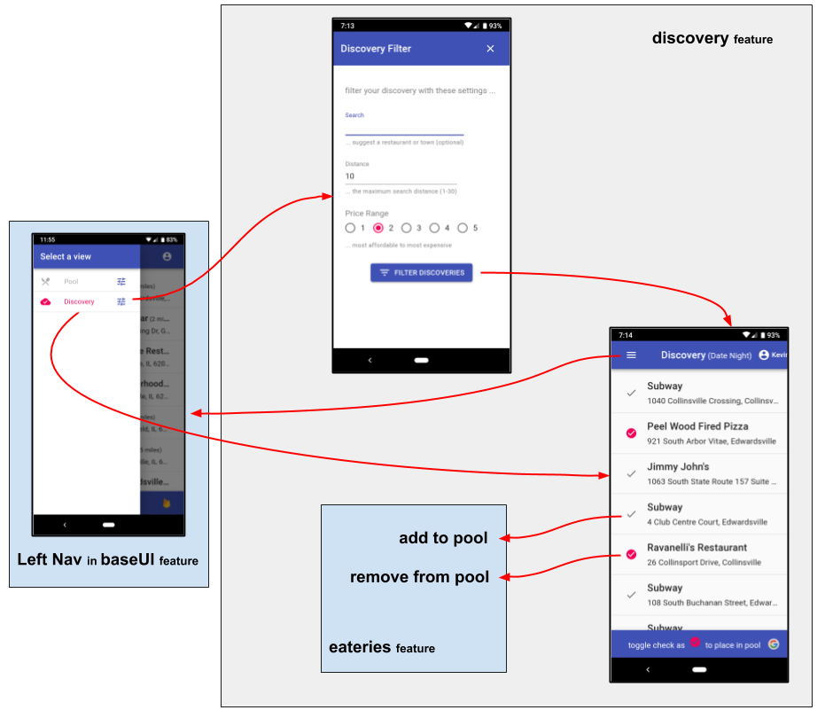

# eatery-nod-w

## Overview

**eatery-nod-w** is **Date Night Restaurant Selector** ... a web-app
**that randomly selects a "date night" restaurant from a pool of
favorites**.  In other words, it gives a **nod** to an **eatery**
(_geeks need to have fun somehow_ :-)

My wife and I have a steady "date night" (with another couple) and we
are always indecisive on which of our favorite restaurants to
frequent, so **eatery-nod-w** provides the spinning wheel!

**eatery-nod-w** is a web-based [PWA] rendition of the [eatery-nod]
**react-native expo mobile app**.


## At a Glance

- [Overview]
  - [Running the App]
  - [Eatery Pool]
  - [Discovery]
  - [Authorization]
- [Technical]
  - [Feature Based Development]
  - [Dependencies]
    - [Runtime Stack]
    - [Tooling]
    - [Deployment]
  - [NPM Scripts]
- [Revision History]
  - [v1.1.0]
  - [v1.0.0]


## Running the App

If you wish to play with **eatery-nod-w**, simply run it from it's
deployed production site: https://eatery-nod-w.js.org/

Currently the sign-in process has **"locked down" account creation**,
because of the limited resources of the free Google Firebase account.
However you can **use a "Guest ID"** that will morph the environment
into your own "mocked" in-memory data source (that doesn't utilize
Firebase).

<ul> <!--- indentation hack --->

Simply use an email id that begins with `guestNO@` (ex:
`@guestNO@myDomain.com`), with a password of `guestNO`.

</ul>

When using a "Guest ID", remember the following:
- Your GPS location will be morphed to New Orleans.
- Your Eateries pool is morphed into an in-memory DB.
- Your Discovery view is live, searching real eateries in New Orleans.
- You can add entries to your pool (from the discovery view), but
  remember that your pool is an in-memory DB ... so if you refresh the site,
  it will revert back to the initial in-memory DB image.

## Eatery Pool

The main screen of eatery-nod is the **Eatery Pool** (_please refer to
the [eateries feature](src/features/eateries)_).

This visualizes your persistent pool of restaurants to select from
(the list can optionally be filtered).

You can select a restaurant directly, or "spin" for a random
selection.

The "detailed" view provides direct communication to the establishment
(phone them, visit their web site, or navigate to their address).




## Discovery

Your pool of eateries is maintained through **Discovery** (_please
refer to the [discovery feature](src/features/discovery)_).

You don't have to maintain the details of your pool by hand.  Rather,
you simply search the restaurants using the **discovery** feature.
This is the same source that is used when you issue a Google Search
(based on [Google Places](https://developers.google.com/places/)).

Within the discovery view, you simply toggle the check next to the
entry.  **Red** entries are in your pool, **Grey** entries are not.




## Authorization

Authorization is provided through the [auth
feature](src/features/common/auth), requiring a validated email/password
before promoting any application screens.


## Technical

The technical details about the **eatery-nod-w** application can be
found here.

**eatery-nod-w** is a web-based [PWA] rendition of the [eatery-nod]
**react-native expo mobile app**.


## Feature Based Development

The implementation of **eatery-nod-w** employs **features** through a
utility called **[feature-u]**, that facilitates **feature-based
solutions**, making it's features truly **plug-and-play**!

**Feature Based Development** greatly improves code comprehension,
because there is a direct correlation between the **problem space**
_(or requirements)_ and the **implementation** _(the code)_!

This approach scales better, making the code easier to maintain,
because the modules _(or features)_ are smaller and more focused.
When features are **plug-and-play**, the application is in essence
broken up into several mini-apps _(so to speak)_.

Here is a complete list of [**eatery-nod-w**
features](src/features/README.md).

You can find more information about **[feature-u]** here:

- **[feature-u teaser]**
- **[feature-u article]**
- **[feature-u docs]**
- **[feature-u repo]**


## Dependencies

In case your wondering what all those dependencies are in
`package.json`, here is a run-down:

### Runtime Stack

<ul> <!--- indentation hack --->

The runtime stack used by **eatery-nod** is:

- [React](https://reactjs.org/): the UI framework
  `"react", "react-dom"`

- [Material-UI](https://material-ui.com/): the UI component library
  `"@material-ui/core", "@material-ui/icons"`

  - [notistack](https://github.com/iamhosseindhv/notistack): extension to Material-UI Snackbar
    `"notistack"`

- [feature-u]: facilitates feature-based solutions
  `"feature-u", "feature-redux", "feature-redux-logic", "feature-router"`

- [redux](https://redux.js.org/): the application state manager
  `"redux", "react-redux"`

- [redux-logic](https://github.com/jeffbski/redux-logic): organizes business logic
  `"redux-logic"`

- _misc redux utils_

  - [action-u](https://action-u.js.org/): redux action creator and organization
    `"action-u"`

  - [astx-redux-util](https://astx-redux-util.js.org/): redux reducer composition utilities
    `"astx-redux-util"`

  - [reselect](https://github.com/reduxjs/reselect): selector library for Redux
    `"reselect"`

- _misc general utils_

  - [lodash](https://lodash.com/): JS utils
    `"lodash.isequal", "lodash.isfunction", "lodash.isplainobject", "lodash.isstring"`

  - [geodist](https://github.com/cmoncrief/geodist): geographical distance calculator
    `"geodist"`

  - [yup](https://github.com/jquense/yup): JS object schema validator
    `"yup"`

- [Firebase](https://github.com/firebase/firebase-js-sdk): Google Firebase SDK
  `"firebase"`

</ul>


### Tooling

<ul> <!--- indentation hack --->

- [Create React App](https://facebook.github.io/create-react-app/): project tooling
  `"react-scripts"`

</ul>


### Deployment

<ul> <!--- indentation hack --->

- [GitHub Pages](https://pages.github.com/): project deployment
  `"gh-pages"`

</ul>


## NPM Scripts

The following NPM Scripts are available:

```
DEVELOPMENT
===========

start ..... runs the app in development mode (http://localhost:3000)
            - the page will reload when edits are applied
            - the console will show any lint errors

TESTING
=======

test ...... launches the test runner in an interactive watch mode


CODE QUALITY
============

lint ...... verify code quality, linting BOTH production and test code
            - real-time linting is ALSO applied within VSCode
            - the console will also show any lint errors


DEPLOYMENT
==========

build ..... builds app for production (in the build/ directory)

deploy .... deploy the app (to: https://eatery-nod-w.js.org/)


MISC
====

eject ..... eject the Create React App project tooling
            NOTE: This is a one-way operation!
                  Once you eject, you can’t go back!
            NOTE: This script has been removed,  so as to 
                  AVOID accidental activation
                  ... easy to do with VSCode tasks
                  THE SCRIPT IS:
                  "eject": "react-scripts eject"
```


## Revision History

Release  | What                                            | *When*
---------|-------------------------------------------------|------------------
[v1.1.0] | TODO                                            | *May xx, 2019*
[v1.0.0] | Initial Release                                 | *May 05, 2019*


<!-- *** RELEASE *************************************************************** -->

### v1.1.0 - TODO *(May xx, 2019)*

<ul><ul><!--- indentation hack ---> 

[GitHub Content](https://github.com/KevinAst/eatery-nod-w/tree/v1.1.0)
&bull;
[GitHub Release](https://github.com/KevinAst/eatery-nod-w/releases/tag/v1.1.0)
&bull;
[Diff](https://github.com/KevinAst/eatery-nod-w/compare/v1.0.0...v1.1.0)

- ?? RUNNING CHANGES HERE HERE

- **Internal Changes:**

  - The [baseUI] feature now **sorts selected menu items by key**,
    giving complete control over the order in which they appear,
    irrespective of feature-expansion order.  This includes the **use
    contracts** for:
    - [Left Nav]
    - [User Menu]

</ul></ul>


<!-- *** RELEASE *************************************************************** -->

### v1.0.0 - Initial Release *(May 05, 2019)*

<ul><ul><!--- indentation hack ---> 

[GitHub Content](https://github.com/KevinAst/eatery-nod-w/tree/v1.0.0)
&bull;
[GitHub Release](https://github.com/KevinAst/eatery-nod-w/releases/tag/v1.0.0)
<!-- Diff ONLY for subsequent releases
&bull;
[Diff](https://github.com/KevinAst/eatery-nod-w/compare/v1.0.0...v1.0.1)
-->

The initial port of this [PWA], from the [eatery-nod] react-native
expo mobile app.

</ul></ul>


<!--- *** REFERENCE LINKS *** ---> 

[Overview]:                  #overview
[Eatery Pool]:               #eatery-pool
[Running the App]:           #running-the-app
[Discovery]:                 #discovery
[Authorization]:             #authorization

[Technical]:                 #technical
[Feature Based Development]: #feature-based-development
[Dependencies]:              #dependencies
[Runtime Stack]:             #runtime-stack
[Tooling]:                   #tooling
[Deployment]:                #deployment

[NPM Scripts]:               #npm-scripts

[Revision History]:    #revision-history
 [v1.1.0]:             #v110---todo-may-xx-2019
 [v1.0.0]:             #v100---initial-release-may-05-2019


[baseUI]:                    src/features/common/baseUI/README.md
[Left Nav]:                  src/features/common/baseUI/README.md#left-nav
[User Menu]:                 src/features/common/baseUI/README.md#user-menu

[feature-u]:                 https://feature-u.js.org/
[feature-u teaser]:          http://bit.ly/feature-u-teaser
[feature-u article]:         http://bit.ly/feature-u-V1
[feature-u docs]:            https://feature-u.js.org/
[feature-u repo]:            https://github.com/KevinAst/feature-u

[PWA]:                       https://developers.google.com/web/progressive-web-apps/
[eatery-nod]:                https://github.com/KevinAst/eatery-nod

