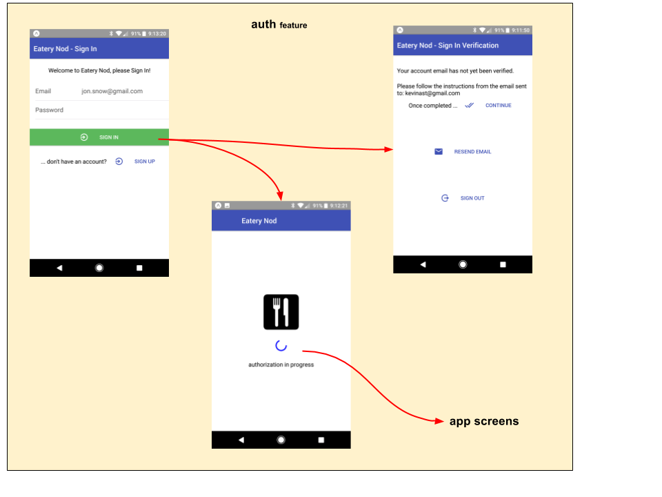

# auth feature

The **auth** feature promotes complete user authentication.
It accomplishes the following:

 - starts authorization process through appDidStart() application-life-cycle-hook
   ```js
   appDidStart({fassets, appState, dispatch}) {
     // kick-start our authorization process
     dispatch( _authAct.autoSignIn() );
   }
   ```

   - interacts with authentication service **(logic)**

   - gathers user credentials from various authentication screens
     **(comp, route, logic)**

   - manages "Auto SignIn" through retained device credentials
     **(logic)**

   - maintains state for this feature **(reducer)**

 - disables app-specific visuals until the user is fully authenticated,
   by promoting various authentication screens until authentication
   is complete **(route, comp)**

 - emits key action that triggers downstream eateries to populate **(logic)**:
   ```
   fassets.actions.userProfileChanged(user)
   ```

## Screen Flow




## State Transition

For a high-level overview of how actions, logic, and reducers interact
together to maintain this feature's state, please refer to the [State
Transition](docs/StateTransition.txt) diagram.
