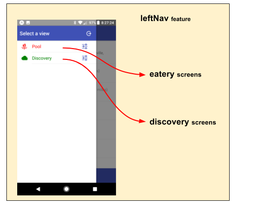

# baseUI

- [Overview]
  - [Usage Contract Summary]
- [Main Layout]
- [App Motif]
  - [Left Nav]
  - [User Menu]
  - [Current View]
  - [Tool Bar]
- [State Transition]


## Overview

The **baseUI** feature provides a UI foundation for an entire
application.  It manages the following characteristics:

- a **Responsive Design** that auto adjusts for desktops, cell phones, and
  portable devices.
- a **UI Theme** allowing the user to choose from light/dark renditions
- _when an active user is **signed-in**, the following items are also
  manifest:_
  - a **[Left Nav]** menu
  - a **[User Menu]** menu
  - a **[Current View]** state _(orchestrating which application view is active)_
  - a **[Tool Bar]** with various artifacts (ex: title bar and footer)

### Usage Contract Summary

<ul> <!--- indentation hack --->

The characteristics manifest by **baseUI** are accomplished in an
**app neutral** way.  While the controls are orchestrated by this
feature, the details are injected autonomously by **external
app-specific features**, through **Usage Contracts**.  The following
contracts are employed _(more detail can be found below)_:


Resource Key                      | Resource               | Description
----------------------------------|------------------------|----------------
**`'AppMotif.LeftNavItem.*'`**    | `<ListItem>`           | Component entries that constitute the **[Left Nav] menu**.
**`'AppMotif.UserMenuItem.*'`**   | `<UserMenuItem>`       | Component entries that make up the **[User Menu] menu**.
**`'AppMotif.auxViewContent.*'`** | `ViewAuxiliaryContent` | Entries that inject auxiliary view content that vary by view manifest in the **[Tool Bar]**. For this resource, the wildcard (`*`) is interpreted as the `curView`.
                                                             


</ul>


## Main Layout

The **Main Layout** is always in affect.  The **baseUI** feature
introduces the following **root** html, providing a layout foundation:

```html
<MainLayout>         ... which in turn includes:
  <MuiThemeProvider> ... provides UI Theme capability
    <CssBaseline/>   ... injects Material UI CSS constructs
    <Notify/>        ... bootstraps notify utility (toasts/alerts/confirm)
    <main>
      <AppMotif>     ... conditionally active when user is signed in
        ... app-specific content injected here
      </AppMotif>
    </main>
  </MuiThemeProvider>
</MainLayout>
```

These constructs directly support:

- a **Responsive Design** that adjusts for desktops, cell phones, and
  portable devices.
- a **UI Theme**, allowing the user to choose from light/dark
  renditions _(automatically integrated in the app)_:
  - maintained in state _(bootstrapped from local storage)_
  - persisted to local storage
  - user-selectable (via a control injected in the [User Menu])
- the activation of the `notify()` utility, supporting programmatic
  **toasts, alerts, and confirmations**.

?? image: cell phone screen (sign-in screen) ... light color, with a toast
?? image: desktop screen (sign-in screen as dialog) ... dark color with same toast

?? image: docs/MainLayout.png NOT SIGNED IN
          - YES/NO? showing sign-in screen)
          - UITheme: one light / one dark
          - a toast or confirmation


## App Motif

When a user is actively signed in, the `<AppMotif>` element is
activated, providing:

- a **[Left Nav]** menu
- a **[User Menu]** menu
- a **[Current View]** state _(orchestrating which app view is active)_
- a **[Tool Bar]** with various artifacts (ex: title bar and footer)


?? image: docs/AppMotif.png annotate/show the inactivated controls and without the middle view


### Left Nav

<ul> <!--- indentation hack --->

The **Left Nav** menu is an app-specific menu that slides out of the
left side:


?? image: docs/LeftNavMenu.png showing activated left nav ANNOTATED

?? TRASH OLD ScreenFlow.png

While the Left Nav control is promoted through the **baseUI** feature,
it's content is accumulated from external features through the
following **Use Contract**:

- **`'AppMotif.LeftNavItem.*'`**: `<ListItem>` component entries that
  constitute the **[Left Nav] menu**.

</ul>


### User Menu

<ul> <!--- indentation hack --->

The **User Menu** is an app-specific menu that is activated from the
top-right of the **Title Bar**:

?? image: docs/UserMenu.png showing an activated User Menu

While the User Menu control is promoted through the **baseUI**
feature, it's content is accumulated from external features through
the following **Use Contract**:

- **`'AppMotif.UserMenuItem.*'`**: `<UserMenuItem>` component entries that
  make up the **[User Menu]**.


</ul>


### Current View

<ul> <!--- indentation hack --->

The **curView** is maintained within the application state as a simple
string.  This is a **very simple process**.  It merely provides a
cross-communication mechanism to:

- get the curView ... `fassets.sel.curView(appState)`
- set the curView ... `fassets.actions.changeView(viewName)`

This state is left to the various view-specific features to
set/interpret.  A **best practice** would be to maintain the curView
value (`viewName`) using the active feature name.

</ul>


### Tool Bar

<ul> <!--- indentation hack --->

The **Tool Bar** aspect entails both the Title and Footer components.
The content of the these items will vary based on the **[Current
View]**.

?? image: docs/ToolBar.png (highlighting content of the title/footer)


While the overall Tool Bar is promoted through the **baseUI**
feature, it's content is accumulated from external features through
the following **Use Contract**:

- **`'AppMotif.auxViewContent.*'`**: `ViewAuxiliaryContent` entries that
  inject auxiliary view content that varies by view.

  For this resource, the wildcard (`*`) is interpreted as the `curView`.

  Here is the **ViewAuxiliaryContent** object:
  
  ```js
    ViewAuxiliaryContent: {
      TitleComp: () => ........... a component defining the header title
                                   DEFAULT: rendering of 'App Motif'
      FooterComp: () => .......... a component defining the entire footer content
                                   DEFAULT: no footer
    }
  ```

</ul>


## State Transition

For a high-level overview of how actions, logic, and reducers interact
together to maintain this feature's state, please refer to the [State
Transition](docs/StateTransition.txt) diagram.


<!--- *** REFERENCE LINKS *** ---> 

[Overview]:               #Overview
[Usage Contract Summary]: #usage-contract-summary
[Main Layout]:            #main-layout
[App Motif]:              #app-motif
[Left Nav]:               #left-nav
[User Menu]:              #user-menu
[Current View]:           #current-view
[Tool Bar]:               #tool-bar
[State Transition]:       #state-transition
