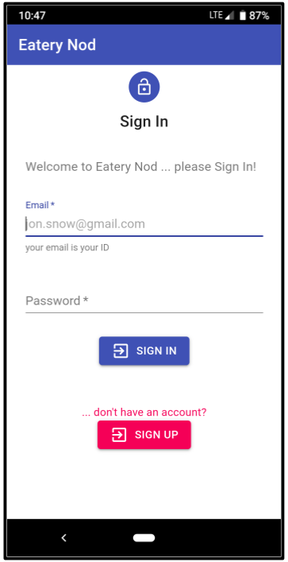
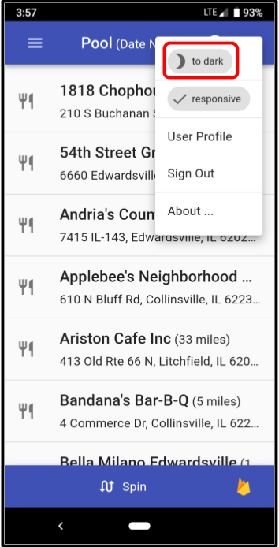
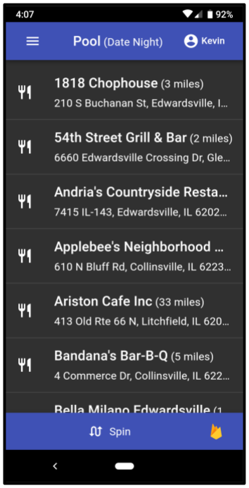
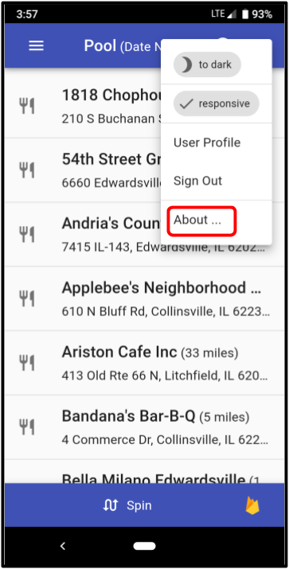
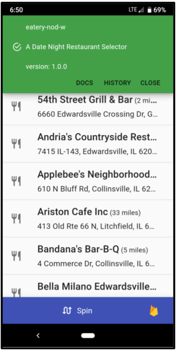
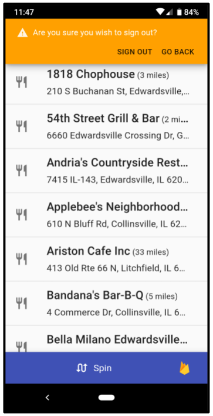
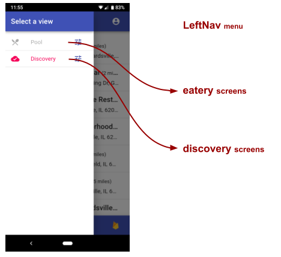
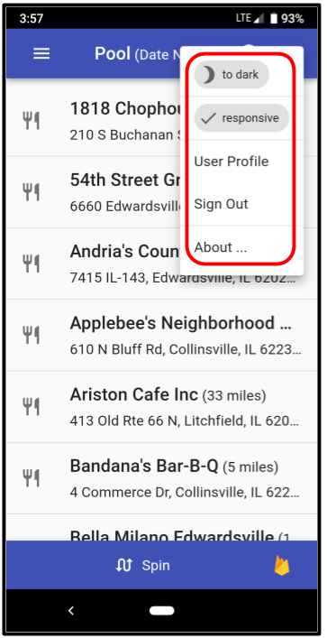

# baseUI


## Overview

The **baseUI** feature provides a UI foundation for an entire
application.  It manages the following characteristics:

- The following items are provided (through the [Main Layout] component
  structure):
  - a **[Responsive Design]** that auto adjusts for desktops, cell phones, and
    portable devices
  - a **[UI Theme]** allowing the user to choose from light/dark renditions
  - an **[About Dialog]** is promoted from information gleaned from the `package.json`
  - the **[Notify]** utility is activated, supporting programmatic
    **toasts, alerts, and confirmations**
- _when an active user is **signed-in**, the following items are also
  manifest (through the [App Motif] component):_
  - a **[Left Nav]** menu
  - a **[User Menu]** menu
  - a **[Current View]** state _(orchestrating which application view is active)_
  - a **[Tool Bar]** with various artifacts (ex: title bar and footer)


## At a Glance

- [Overview]
- [Usage Contract Summary]
- [Main Layout]
  - [Responsive Design]
  - [UI Theme]
  - [About Dialog]
  - [Notify]
- [App Motif]
  - [Left Nav]
  - [User Menu]
  - [Current View]
  - [Tool Bar]
- [State Transition]


## Usage Contract Summary

The characteristics manifest by **baseUI** are accomplished in an
**app neutral** way.  While the controls are orchestrated by this
feature, the details are injected autonomously by **external
app-specific features**, through **Usage Contracts**.  The following
contracts are employed _(more detail can be found in the sections that
follow)_:


Resource Key                      | Resource               | Description
----------------------------------|------------------------|----------------
**`'AppMotif.LeftNavItem.*'`**    | `<ListItem>`           | Component entries that constitute the **[Left Nav] menu**.
**`'AppMotif.UserMenuItem.*'`**   | `<UserMenuItem>`       | Component entries that make up the **[User Menu] menu**.
**`'AppMotif.auxViewContent.*'`** | `ViewAuxiliaryContent` | Entries that inject auxiliary view content that vary by view manifest in the **[Tool Bar]**. For this resource, the wildcard (`*`) is interpreted as the `curView`.
                                                             


## Main Layout

The **Main Layout** is always in affect.  It promotes the Material-UI
(MUI) theming/styling using a responsive layout, through the re-usable
top-level `<MainLayout>` component ... auto injected through
**feature-u**'s Application Life Cycle Hooks:

```js
 appWillStart({fassets, curRootAppElm}) {
   return (
     <MainLayout>
       {curRootAppElm}
     </MainLayout>
   );
 }
```

The following items are provided through the  `<MainLayout>` component:

- a **[Responsive Design]** that auto adjusts for desktops, cell phones, and
  portable devices

- a **[UI Theme]** allowing the user to choose from light/dark renditions

- an **[About Dialog]** is promoted from information gleaned from the `package.json`

- the **[Notify]** utility is activated, supporting programmatic
  **toasts, alerts, and confirmations**

These items are manifest through the following html (within the
`<MainLayout>` component):

```html
<MainLayout>         ... which in turn includes:
  <MuiThemeProvider> ... provides UI Theme capability
    <CssBaseline/>   ... injects Material UI CSS constructs supporting Responsive Design
    <Notify/>        ... bootstraps notify utility (toasts/alerts/confirm)
    <main>
      <AppMotif>     ... conditionally active when user is signed in
        ... app-specific content injected here
      </AppMotif>
    </main>
  </MuiThemeProvider>
</MainLayout>
```

### Responsive Design

<ul> <!--- indentation hack --->

**Responsive Design** is an approach to web development that allows
web pages to render well on a variety of devices and window or screen
sizes (desktops, cell phones, tablets, etc.).  The **baseUI** feature
uses the Material UI CSS constructs (via the `<CssBaseline/>`
component) to accomplish this.

Here is a dialog rendered on a desktop browser:
<p align="center"></p>

Here is the same dialog shown on a cell phone.  _**Notice it dynamically overtakes the entire screen**_:
<p align="center"></p>

</ul>


### UI Theme

<ul> <!--- indentation hack --->

The **UI Theme** allows the user to choose from light or dark
renditions, and is automatically integrated in the app.

- `uiTheme` is maintained in state _(please refer to the the [State Transition](docs/StateTransition.txt) diagram)_.
- is user-selectable (via a control automatically injected in the [User Menu])
- and is persisted to local storage (bootstrapped during app start-up)

Here is an app screen shown in a "light" theme.  _**The User Menu is shown with the UI Theme control**_:
<p align="center"></p>

Here is the same screen shown in a "dark" theme.
<p align="center"></p>

</ul>


### About Dialog

<ul> <!--- indentation hack --->

An **About Dialog** is promoted through a control that is
automatically injected in the [User Menu]).

This information is automatically gleaned from the `package.json`
_(showing name, description, and version)_, and provides links to the
app's documentation and revision history.

Here is the control that activates **About**:
<p align="center"></p>

and here is the **About Dialog**:
<p align="center"></p>

from the information defined here:

**`package.json`**
```json
{
  "name": "eatery-nod-w",
  "version": "1.0.0",
  "description": "A Date Night Restaurant Selector",
  "about": {
    "docs": "https://github.com/KevinAst/eatery-nod-w/blob/master/README.md",
    "hist": "https://github.com/KevinAst/eatery-nod-w/blob/master/README.md#revision-history"
  },
  ...
}
```

</ul>


### Notify

<ul> <!--- indentation hack --->

The **Notify** utility is activated by injecting the `<Notify/>`
component.

This allows the programmatic notification of user information in the
form of **toasts**, **alerts**, and **confirmations**.

Example _(see **notify utility** for complete details)_:

```js

// ... welcome toast
toast({ msg:'Welcome to eatery-nod });

// ... sign-out confirmation
confirm.warn({ 
  msg: 'Are you sure you wish to sign out?', 
  actions: [
    { txt: 'Sign Out', action: () => dispatch( _authAct.signOut() ) },
    { txt: 'Go Back' }
  ]
});

// ... unexpected error
toast.error({
  msg: err.formatUserMsg(),
  actions: [
    { txt:    'details',
      action: () => {
        alert.error({ msg: `An unexpected error occurred:

${err}

If this problem persists, please contact your tech support.`
         });
       }},
   ]
 });
```

Here is a rendition of a sign-out confirmation _(from above)_:
<p align="center"></p>

</ul>


## App Motif

AppMotif is a re-usable top-level component that establishes the
following application characteristics:

- a **[Left Nav]** menu
- a **[User Menu]** menu
- a **[Current View]** state _(orchestrating which application view is active)_
- a **[Tool Bar]** with various artifacts (ex: title bar and footer)

<p align="center"></p>

While these controls are promoted through AppMotif, it's content is
accumulated from external features through various **Use Contracts**.

AppMotif is auto injected through the [Main Layout] component,
however, it is only active when an active user is **signed-in**.

### Left Nav

<ul> <!--- indentation hack --->

The **Left Nav** menu is an app-specific menu that slides out of the
left side:

<p align="center"></p>

While the Left Nav control is promoted through the **baseUI** feature,
it's content is accumulated from external features through the
following **Use Contract**:

- **`'AppMotif.LeftNavItem.*'`**: `<ListItem>` component entries that
  constitute the **[Left Nav] menu**.

  These entries are **sorted by key**, giving complete control over the
  order in which they appear, irrespective of feature-expansion
  order.

</ul>


### User Menu

<ul> <!--- indentation hack --->

The **User Menu** is an app-specific menu that is activated from the
top-right of the **Title Bar**:

<p align="center"></p>

While the User Menu control is promoted through the **baseUI**
feature, it's content is accumulated from external features through
the following **Use Contract**:

- **`'AppMotif.UserMenuItem.*'`**: `<UserMenuItem>` component entries
  that make up the **[User Menu]**.

  These entries are **sorted by key**, giving complete control over the
  order in which they appear, irrespective of feature-expansion
  order.

</ul>


### Current View

<ul> <!--- indentation hack --->

The **curView** is maintained within the application state as a simple
string _(please refer to the the [State
Transition](docs/StateTransition.txt) diagram)_.

This is a **very simple process**.  It merely provides a
cross-communication mechanism to:

- get the curView ... `fassets.sel.curView(appState)`
- set the curView ... `fassets.actions.changeView(viewName)`

The interpretation of the `curView` state is left to the various
view-specific features.  A **best practice** would be to maintain the
`curView` value using the active feature name _(for view-based
features)_, and interpreted by their routes (for display).

</ul>


### Tool Bar

<ul> <!--- indentation hack --->

The **Tool Bar** aspect entails both the Title and Footer components.
The content of the these items will vary based on the **[Current
View]**.

<p align="center"></p>


While the overall Tool Bar is promoted through the **baseUI**
feature, it's content is accumulated from external features through
the following **Use Contract**:

- **`'AppMotif.auxViewContent.*'`**: `ViewAuxiliaryContent` entries that
  inject auxiliary view content that varies by view.

  For this resource, the wildcard (`*`) is interpreted as the `curView`.

  Here is the **ViewAuxiliaryContent** object:
  
  ```js
    ViewAuxiliaryContent: {
      TitleComp: () => ........... a component defining the header title
                                   DEFAULT: rendering of 'App Motif'
      FooterComp: () => .......... a component defining the entire footer content
                                   DEFAULT: no footer
    }
  ```

</ul>


## State Transition

For a high-level overview of how actions, logic, and reducers interact
together to maintain this feature's state, please refer to the [State
Transition](docs/StateTransition.txt) diagram.


<!--- *** REFERENCE LINKS *** ---> 

[Overview]:               #overview
[Usage Contract Summary]: #usage-contract-summary
[Main Layout]:            #main-layout
[Responsive Design]:      #responsive-design
[UI Theme]:               #ui-theme
[About Dialog]:           #about-dialog
[Notify]:                 #notify
[App Motif]:              #app-motif
[Left Nav]:               #left-nav
[User Menu]:              #user-menu
[Current View]:           #current-view
[Tool Bar]:               #tool-bar
[State Transition]:       #state-transition
