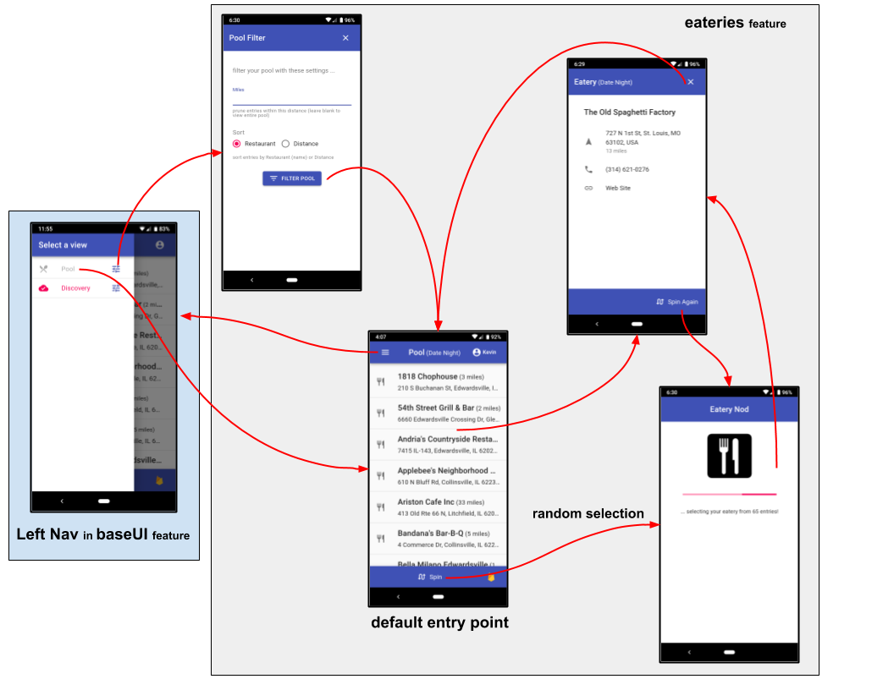

# eateries feature

The **eateries** feature manages and promotes the eateries view
... a list of the pooled (and filtered) restaurants, with the ability
to select an eatery through a random spin.  Selected eateries provides
the ability to phone, visit their web site, and navigate to them.

## Screen Flow

## State Transition

For a high-level overview of how actions, logic, and reducers interact
together to maintain this feature's state, please refer to the [State
Transition](docs/StateTransition.txt) diagram.
