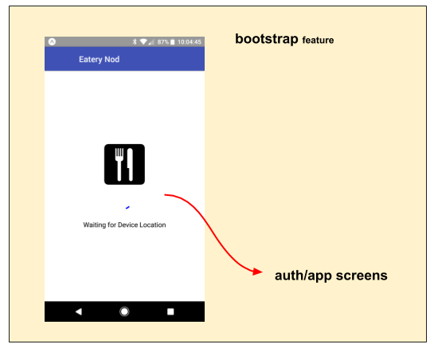

# bootstrap feature

The **bootstrap** feature drives a critical-path app initialization
process that must complete before the app can run.  

It promotes the `'bootstrap.*'` use contract, through which external
features may inject their initialization needs.

It accomplishes the following:

 - initiates the bootstrap initialization process, by dispatching
   the `bootstrap()` action **(appDidStart)**.

   - This process operates under the `'bootstrap.*'` use contract
     **(fassets.use, logic)**, by which external features may inject
     their initialization needs.
     
   - The `bootstrap.setStatus(statusMsg)` action is emitted to reflect
     the overall bootstrap status (e.g. 'Waiting for bla bla bla' -or-
     'COMPLETE').  This status is promoted through a SplashScreen to
     communicate what is going on to the user.
     
   - The `bootstrap.complete()` action is emitted when all bootstrap
     initialization has completed, and the app is fully initialized
     and ready to run.  This action should be monitored by external
     features to start the app.

 - all downstream visuals are disabled until the bootstrap process is
   complete ... displaying a SplashScreen **(route)**

## State Transition

For a high-level overview of how actions, logic, and reducers interact
together to maintain this feature's state, please refer to the [State
Transition](docs/StateTransition.txt) diagram.

## Screen Flow

