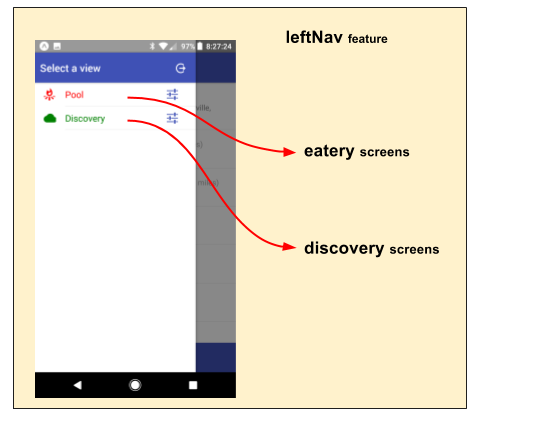

# leftNav feature

The **leftNav** feature promotes the app-specific Drawer/SideBar
on the app's left side.

This feature is app-neutral, as it pulls in it's menu items from
external features using the fassets.use 'leftNavItem.*' contract.

## Screen Flow

# INCORPORATE currentView docs HERE (eliminate any 'currentView' feature name ????????????????????????????????

# currentView feature

The **currentView** feature maintains the currentView state (as a string).

This is a **very simple process**.  It merely provides a
cross-communication mechanism to:

 1. set the currentView ... `fassets.actions.changeView(viewName)`
 2. get the currentView ... `fassets.sel.getView(appState)`

It is up to the various view-specific features to set/interpret.  A
**best practice** would be to maintain the currentView value
(`viewName`) using the active feature name.

## State Transition

For a high-level overview of how actions, logic, and reducers interact
together to maintain this feature's state, please refer to the [State
Transition](docs/StateTransition.txt) diagram.
