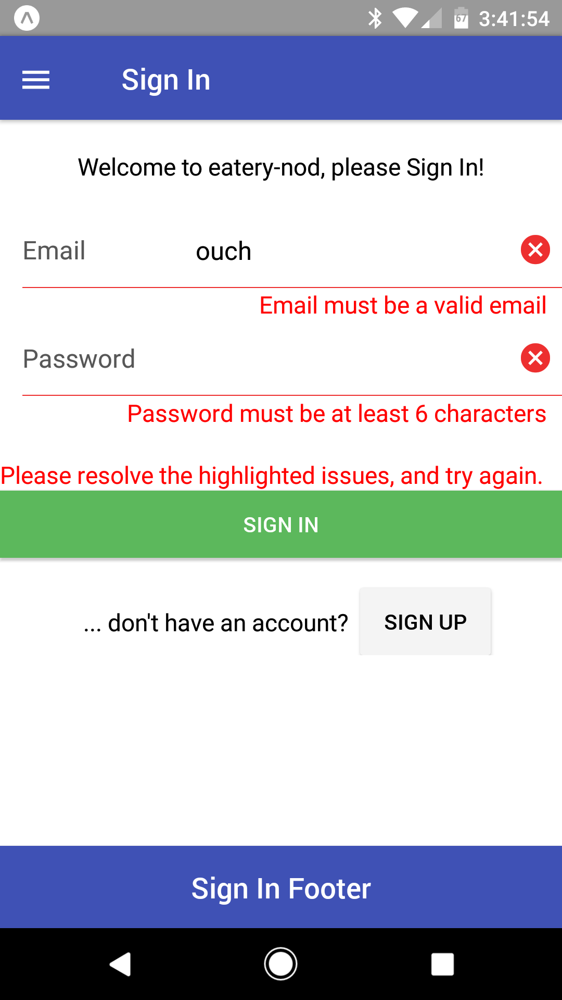
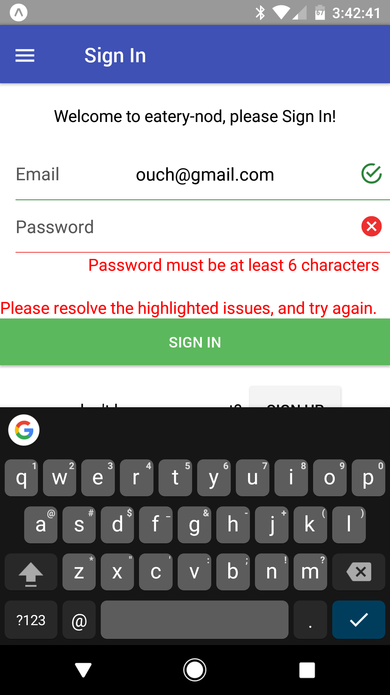

# iForms *(Intelligent Forms)*

iForms is a logic-based forms utility.  It provides the basis for
automating your form processing through [redux-logic] hooks.  This
simplifies your display components (removing the clutter), while
encapsulating business-related concerns (like validation, and forms
submission) squarely where it belongs - **in your business logic**.

If your using [redux-logic], then iForms is your go-to choice for forms!

## At a Glance

- [Intro](#intro)
- [Sample](#sample)
- [A Closer Look](#a-closer-look)
  * [Form Actions](#form-actions)
  * [Form Logic](#form-logic)
  * [Form State](#form-state)
  * [Form Components](#form-components)
  * [Dynamic Validation](#dynamic-validation)
  * [Form Input/Output Boundaries (via App Domains)](#form-inputoutput-boundaries-via-app-domains)
  * [Form Processing](#form-processing)
- [API](#api)
  * [IFormMeta](#iformmeta)
    - registrar
      * [formActionGenesis](#iformmetaregistrarformactiongenesis)
      * [formLogic](#iformmetaregistrarformlogic)
      * [formReducer](#iformmetaregistrarformreducer)
    - [formStateSelector](#iformmetaformstateselector)
    - [IForm](#iformmetaiform)

## Intro

Let's be honest - implementing React forms by hand is extremely verbose.
There are so many details to attend to:

 - **Field Validation**: *a tricky process in a polished UI that dynamically presents
   messages only at appropriate times*
   * how to model the validation constraints?
   * when to validate and when to expose messages? *... based on
     dynamics of field touches, and form submission*
   * how to enforce validation constraints?

 - **Form Inputs/Outputs**
   * how are app-specific inputs/outputs translated into/out-of the
     forms processor?

 - **Form Processing**
   * how are app-specific logic hooks injected, when the form is
     submitted for processing?

There are a lot of forms processors out there, many of which attempt
way too much magic, some at a significant performance cost.  But none
of them model forms processing where it belongs: **in your logic!**

iForm is a light-weight reusable forms solution whose focus is on a
concise declarative form definition:

  - **Form Schemas** are defined through [Yup] (a lightweight [Joi]
    inspired utility), concisely defining:

    * the fields that make up a form
    * field data types
    * validation constraints (in a declarative way)
    * field labels *(by modeling in schema, provides access to both the form UI and validation messages)*

  - **Translation hooks** are available to map app-specific domains
    to/from the forms processor, *making it convenient for your logic
    to utilize app-specific structures*.

  - **Forms-related aspects** needed for all forms are **auto-generated**,
    including:
    * actions (a pre-defined set of actions required for all forms)
    * logic (implementing the hard work of validation, and dynamic presentation)
    * reducers (facilitating form state management)

  - A series of **input form elements** (e.g. [ITextField]) is provided,
    which auto-wires to the iForm actions/state, and automatically
    formats validation msgs, etc.

**Bottom line**: iForms promotes **painless re-usability!**  As a bonus,
it is logic-based, so it is **extremely simple to inject
app-specific logic** to manipulate various business-related items.


## Sample

In this sample our form gathers information for a sign-in process
*(email and password)*.

The following screens represent the form's progression after various
user interactions *(click each screen to expand)*:

| initial | partial email | premature `Sign In` | email correction | password correction | `Sign In` accepted
| ------- | ------- | ------- | ------- | ------- | -------
| [](screenShots/screen1.png) | [](screenShots/screen2.png) | [](screenShots/screen3.png) | [](screenShots/screen4.png) | [](screenShots/screen5.png) | [](screenShots/screen6.png) 

- **Notice the dynamics** of the validation messages.

- **Also notice** if we process the form pre-maturely, the process
  request is rejected, and all field validations are exposed.


Using iForms, this process is **accomplished with minimal effort**.
We simply do the following:

1. First we define an IFormMeta instance that represents our sign-in
   form. 
   *This is a simple and declarative process*, that packs a lot of
   information!
   **Think of it as an extension to your logic modules**!!

   **[src/logic/iForms/signInFormMeta.js](../../../../src/logic/iForms/signInFormMeta.js)**
   ```js
   import Yup        from 'yup';
   import IFormMeta  from '../../util/iForms/IFormMeta';
   import actions    from '../../actions';

   export default IFormMeta({
     formDesc:  'Sign In',
     formSchema: Yup.object().shape({
       email:    Yup.string().required().email()        .label('Email'),
       pass:     Yup.string().required().min(6).max(9)  .label('Password'),
     }),
     formActionsAccessor: ()         => actions.auth.signIn,
     formStateSelector:   (appState) => appState.auth.signInForm,
   });
   ```

   - The `formDesc` defines a label for our form *(for human
     consumption)*.

   - The `formSchema` defines all of our form fields (email, pass),
     including:
     * names
     * types
     * labels *(for human consumption)*
     * validation constraints

   - The `formActionsAccessor` identifies where the sign-in form
     actions can be found (the root of our action-u tree).

   - The `formStateSelector` identifies where the sign-in form
     state can be found (the root of our state tree).

2. Next we register the auto-generated forms-related items.  This is
   accomplished in 3 different places, and is basically 3 lines of
   code *(please refer to [A Closer Look](#a-closer-look) for
   registration details)*:

   ```js
   import signInFormMeta from '../logic/iForms/signInFormMeta';

   // iForm action creators to be injected into action-u generateActions()
   ... signInFormMeta.registrar.formActionGenesis(): ActionGenesis
   
   // iForm logic modules (providing intelligent validation) to be registered to redux-logic
   ... signInFormMeta.registrar.formLogic(): logic[]
   
   // iForm reducer to be registered in the redux state management process
   ... signInFormMeta.registrar.formReducer(): function
   ```

3. Lastly we define our component screen that promotes the form (and
   it's fields):

   **[src/comp/SignInScreen.js](../../../../src/comp/SignInScreen.js)**

   ```js
   import React        from 'react';
   import {connect}    from 'react-redux';
   import PropTypes    from 'prop-types';
   import {Body,
           ... omitted for brevity
           View}         from 'native-base';
   import signInFormMeta from '../logic/iForms/signInFormMeta';
   import ITextField     from '../util/iForms/comp/ITextField';

   function SignInScreen({iForm}) {
   
     const formLabel     = iForm.getLabel();
     const formInProcess = iForm.inProcess();
   
     return (
       <Container>
         <Header>
           <Body>
             <Title>{formLabel}</Title>
           </Body>
         </Header>
   
         <Content>
          <Form>
   
            <View>
              <Text>Welcome to eatery-nod, please {formLabel}!</Text>
            </View>
   
            <ITextField fieldName="email"
                        iForm={iForm}
                        placeholder="jon.snow@gmail.com"
                        keyboardType="email-address"/>
   
            <ITextField fieldName="pass"
                        iForm={iForm}
                        secureTextEntry/>
   
            <Text style={{color:'red'}}>{iForm.getMsg()}</Text> {/* form msg  */}
   
            <Button success
                    full
                    onPress={iForm.handleProcess}
                    disabled={formInProcess}>
              <Text>{formLabel}</Text>
            </Button>
   
           {formInProcess && <Spinner color="blue"/>} {/* inProcess spinner  */}
   
          </Form>
         </Content>
       </Container>
     );
   }
   
   SignInScreen.propTypes = {
     iForm: PropTypes.object.isRequired,
   };
   
   export default connect(
     // mapStateToProps()
     (appState) => ({ formState: signInFormMeta.formStateSelector(appState) }),
   
     // mapDispatchToProps()
     null,
   
     // mergeProps()
     (stateProps, dispatchProps) => ({ iForm: signInFormMeta.IForm(stateProps.formState, 
                                                                   dispatchProps.dispatch) })
   )(SignInScreen);
   ```
   
   - **Notice** that we utilize the `ITextField` iForm component to promote the
     text fields.  This component auto-wires to the iForm actions/state,
     and automatically promotes validation msgs at the appropriate time.
     
   - **Also notice** that we use the **iForm helper object** (promoted
     from signInFormMeta) that insulates us from the details of the
     iForm state and handlers.  From this we can:
      * access:
        - field labels (and form labels)
        - field values
        - field validation messages (and form messages)
      * handle a variety of events


## A Closer Look

All forms are modeled consistently, through a set of reusable items
(actions, logic, and reducers) that is auto-generated by iForms.

The following topics further reveal how iForm works, and provides
insight into typical app-specific hooks.

TODO: consider a diagram


### Form Actions

The following standard actions are maintained for each iForm:

```
${formActionGenesis}: {

  open([domain] [,formMsg])      ... activate the form state, initiating form processing

  fieldChanged(fieldName, value) ... maintain controlled field state change (with validation)
                                     NOTE: IForm logic supplements action with validation msgs

  fieldTouched(fieldName)        ... maintain field touched status, impacting validation dynamic exposure
                                     NOTE: IForm logic supplements action with validation msgs

  process()                      ... process this form
                                     NOTE 1: IForm logic will reject this action, when the form is invalid
                                     NOTE 2: IForm logic supplements action with values (of appropriate
                                             data types) and domain (in app-specific structure)

    reject(msgs)                 ... reject process action with supplied validation msgs

  close()                        ... close this form

  ...appSpecificActions()        ... app-specific action creators supplementing the auto-generated formActions
}
```

**Registration**

Even though these actions are auto-generated, they must be registered
in your action-u structure.  This is accomplished through the
[iFormMeta.registrar.formActionGenesis()](#iformmetaregistrarformactiongenesis)
method.  Here is an example:

**[src/actions/auth.js](../../../../src/actions/auth.js)**
```js
import {generateActions} from 'action-u';
import signInFormMeta    from '../logic/iForms/signInFormMeta';

export default generateActions.root({
  auth: {
    ... snip snip (other actions omitted)

    // inject the standard iForm auto-generated form actions
    // ... open(), fieldChanged(), fieldTouched(), process(), process.reject(), close()
    signIn: signInFormMeta.registrar.formActionGenesis({

      // along with additional app-specific actions:

                  // auth.signIn(email, pass): Action
                  // > SignIn with supplied email/pass
                  actionMeta: {
                    traits: ['email', 'pass'],
                  },

      complete: { // auth.signIn.complete(auth): Action
                  // > signIn completed successfully
                  actionMeta: {
                    // traits: ['auth],
                  },
      },

      fail: {     // auth.signIn.fail(err): Action
                  // > signIn failure
                  actionMeta: {
                    traits: ['err'],
                  },
      },


    }),
  },
});
```

**App-Specific Additions**

You can supply additional app-specific actions through the optional
`appInjectedFormActions`
[iFormMeta.registrar.formActionGenesis()](#iformmetaregistrarformactiongenesis)
parameter (as seen above).

This is typically used to introduce fail/complete actions that are
spawned out of app-specific logic modules.  

**NOTE:** the formAction root can even become an action creator by
promoting a top-level actionMeta node in this structure.


### Form Logic

iForms maintain a set of redux-logic modules that orchestrates various
iForm characteristics, such as validation.  The following actions are
monitored by these logic modules:

| monitored formActions         | perform following logic
| ----------------------------- | -------------------------
| fieldChanged<br/>fieldTouched | validate specific field, injecting msgs in action
| process                       | validate ALL fields, injecting msgs in action <br/> - reject `process` action on validation problems (via `process.reject` action) <br/> - allow `process` action on clean validation, supplementing action with values/domain


**Registration**

Even though iForm logic modules are auto-generated, they must be
registered in your app's redux-logic catalog.  This is accomplished
through the
[iFormMeta.registrar.formLogic()](#iformmetaregistrarformlogic)
method.  Here is an example:

**[src/logic/auth.js](../../../../src/logic/auth.js)**
```js
import signInFormMeta from './iForms/signInFormMeta';

// promote all logic (accumulated in index.js)
export default [
  ... snip snip (other logic modules omitted)

  // signIn logic (NOTE: form logic just be registered BEFORE app-specific logic)
  ...signInFormMeta.registrar.formLogic(), // inject the standard SignIn form-based logic modules
  processSignIn,                           // app-specific sign-in logic
];
```

**App-Specific Additions**

App-specific form processing logic additions can be injected through
the normal redux-logic registration process (as seen above - see
`processSignIn`).  

This is typically used to inject form submission process logic, once
the form has been cleanly validated by iForms.

**NOTE:** The only caveat is your app-logic should be registered after the
iForm logic (so as to auto reject invalid form state).


### Form State

The following state shape is maintained for each iForm.

**Please Note:** Typically this state tree is NOT interpreted directly
... rather the [IForm helper object](#iformmetaiform) provides a
convenient abstraction to both a) accessors and b) handlers to change
the state.

```
${formState}: { // ex: appState.auth.signInForm (null for inactive form)

  labels: {       // field labels (UI promotion and validation msg content)
    FORM:         string, // form desc
    <fieldName1>: string,
    <fieldName2>: string,
  },

  values: {       // field values
    <fieldName1>: string,
    <fieldName2>: string,
  },

  msgs: {          // validation msgs (if any) ... initial: {}
    FORM:          string, // msg spanning entire form ... non-exist for valid
    <fieldName1>:  string, // non-exist for valid
    <fieldName2>:  string, // non-exist for valid
  },

  validating: {    // demarks which fields are being validated
                   // ... based on whether it has been touched by user (internal use only)
    FORM:          boolean, // ALL fields validated (takes precedence)
    <fieldName1>:  boolean,
    <fieldName2>:  boolean,
  },

  inProcess: boolean, // is form being processed?
}
```

**Registration**

Even though the state reducers are auto-generated, they must be
registered in your redux state management process.  This is
accomplished through the
[iFormMeta.registrar.formReducer()](#iformmetaregistrarformreducer)
method.  Here is an example:


**[src/appState/auth.js](../../../../src/appState/auth.js)**
```js
import {combineReducers}  from 'redux';
import signInFormMeta     from '../logic/iForms/signInFormMeta';

export default combineReducers({
  ... snip snip (other reducers omitted)
  signInForm: signInFormMeta.registrar.formReducer(), // inject the standard SignIn form-based reducer
});
```

**App-Specific Additions**

Typically, no app-specific additions are required for form state.


### Form Components

iForm provides a series of input form element components
(e.g. [ITextField]) that integrates seamlessly with IForms.  

These components encapsulate various input aspects using a consistent
pattern.  For example, validation messages are automatically exposed
at the appropriate time, considering user touches and form submission.

Each component integrates seamlessly with iForms by auto-wiring to
the IForm helper object.  Because of this, using these components is
as simple as passing the fieldName and iForm helper object.

```js
<ITextField fieldName="email"
            iForm={iForm}/>
```

Each component consistently employs the following heuristics:

1. Present form elements in a polished way

2. Dynamically expose validation messages at the appropriate time,
   considering user touches and form submission

3. Access IForm state (for values, labels, messages, etc.)

4. Emit low-level actions (via IForm handlers) required to
   interact with IForm logic.

Please note that these components are specific to react-native, and
use the native-base component library.  With that said, you can use
them as a pattern to build your own, using your preferred component
library.  Just be sure to encapsulate the same feature set!


### Dynamic Validation

Form validation is triggered by low-level events *(such as field value
changes or focus changes)*, as well has high-level events *(such as form
process requests)*.  

Internally, all form fields are validated 100% of the time.  This
supports the ability to determine validity at all times *(for some
internal need)*. This can be accomplished using
[IForm's](#iformmetaiform) `isValid()` or `getMsg()` methods.

Whether validation messages are exposed to the user is a different
topic, and is based on whether a field has been touched, or the form
has been processed.  This can be accomplished using
[IForm's](#iformmetaiform) `isValidationExposed()` or `getExposedMsg()`
methods.

You can see an example of how this is accomplished in the
[ITextField] component.


### Form Input/Output Boundaries (via App Domains)

When a form is initiated, the `open` [action](#form-actions) is
optionally supplied a domain object, to initialize the form (when not
supplied all form fields start out as empty strings).

We use the term "domain" in a generic way, that can manifest itself in
a variety of different things.  It can be a real application domain
object (say from an API call), or another part of your state tree, or
any number of other things.

Likewise, when the form is processed (via the `process`
[action](#form-actions)), the form values will be mapped back to the
domain representation (retained in the `process` action).

This makes it convenient for your logic to operate using app-specific
structures.

You can easily define the mapping between your domain and the form
values structure, through the optional
`mapDomain2Form`/`mapPropsToValues` parameters of
[IFormMeta](#iformmeta).  By default (when not supplied), the domain
structure is assumed to be "one in the same" as the form values
structure (through a straight mapping of the well known iForm fields).


### Form Processing

All forms are processed through the `process` form action.  This is
often referred to as "submitting the form".

iForm logic automatically monitors the `process` action, validating the
entire form (i.e. all fields of the form).

 - when form validation issues exist, the `process` action is rejected
   by re-issuing a `process.reject` action (containing the messages)

 - when the form validation is clean, the `process` action is allowed,
   after supplementing it with the current form state (both raw values,
   and app-specific domain).

This means that it is extremely easy to inject app-specific form
processing logic.  The logic merely:

 - monitors the the `process` action
   * which is guaranteed to be valid
   * and contains the current values/domain from which to spawn the app-specific work!
 - ultimately the app logic will either issue
   * a form close() to take down the form
   * or an open() to communicate processing errors

Nothing could be easier!

Here is an example:

```js
export const processSignIn = createLogic({

  name: 'auth.processSignIn',
  type: String(actions.auth.signIn.process),

  process({getState, action, api}, dispatch, done) {

    ... implement app-specific logic

    ... has access to validated form:
        - action.values
        - action.domain

    ... on success:
        dispatch( actions.auth.signIn.close() );

    ... on failure:
        dispatch( actions.auth.signIn.open(domain, errMsg) );
        
  },

});
```


## API

### IFormMeta

The primary iForm function that creates an IFormMeta object
encapsulating the characteristics of an Intelligent Form (a reusable
forms utility that is logic-based using redux-logic).

**API:**
```
  IFormMeta({formDesc,
             formSchema,
             formActionsAccessor,
             formStateSelector,
             [mapDomain2Form],
             [mapForm2Domain]}): IFormMeta
```

- **formDesc**: string - a human-interpretable description for this form (ex:
  'Sign In').
  
- **formSchema**: ObjectSchema - the Yup Schema object defining form
  fields, labels, and validation characteristics.
  
- **formActionsAccessor**: function - an accessor function that
  promotes our specific formActions.  A function is used to avoid
  cyclic dependencies in the startup bootstrap process (because BOTH
  actions and IFormMeta instances are created in-line).

  `API: () => formActions`
  
- **formStateSelector**: function - a selector function that promotes
  our specific formState, given the top-level appState.

  `API: (appState) => formState`
  
- **[mapDomain2Form]**: function - optionally define a mapping between
  an app domain object and the form values (employed through the
  `open` action).  When not specified, a straight mapping of any iForm
  fields is used.

  `API: (domain) => values`
  
  Ex:
  ```
    mapDomain2Form: (domain) => ({
      id:        domain.id,
      email:     domain.email,
      firstName: domain.name.first,
      lastName:  domain.name.last
    })
  ```
  
- **[mapForm2Domain]**: function - optionally define a mapping between
  form values and the app domain object (employed through the
  `process` action).  When not specified, a straight mapping of the
  iForm values is used (i.e. domain is same as values).

  `API: (castValues) => domain // NOTE: castValues have been "cast" to the appropriate type`
  
  Ex:
  ```
    mapForm2Domain: (castValues) => ({
      id:       castValues.id,
      email:    castValues.email,
      name:  {
        first:  castValues.firstName,
        last:   castValues.lastName
      }
    })
  ```

**Return**: **IFormMeta** - exposing various aspects of an Intelligent Form ...
```
{
  registrar: { // auto-generated items to be externally registered
    // iForm action creators to be injected into action-u generateActions()
    formActionGenesis([appInjectedFormActions]): ActionGenesis
    
    // iForm logic modules (providing intelligent validation) to be registered to redux-logic
    formLogic(): logic[]
    
    // iForm reducer to be registered in the redux state management process
    formReducer(): function
  }

  // the selector that promotes self's specific formState, given the top-level appState
  formStateSelector(appState): formState

  // create an IForm helper object, providing convenience accessors/handlers, 
  // avoiding direct formState interpretation
  IForm(formState, dispatch): Object
}
```


### iFormMeta.registrar.formActionGenesis

Promote the auto-generated action creators required by self's iForm.
This is an action-u ActionGenesis sub-structure that is to be injected
into the action-u generateActions() process.

The [Form Actions](#form-actions) section details what these actions
look like.

**API:**
```
formActionGenesis([appInjectedFormActions]): ActionGenesis
```

- **[appInjectedFormActions]**: ActionGenesis - optionally specify
additional app-specific action creators to supplement the
auto-generated formActions.  This is typically used to introduce
fail/complete actions that are spawned out of app-specific logic
modules.  NOTE: the formAction root can even become an action creator
by promoting a top-level actionMeta node in this structure.  Please
refer to [Form Actions](#form-actions) for an example of this.


### iFormMeta.registrar.formLogic

Promote the redux-logic modules that perform low-level iForm business
logic (such as validation).  This should be registered to the app's
redux-logic process.

The [Form Logic](#form-logic) section discusses this in more detail.

**API:**
```
formLogic(): logic[]
```


### iFormMeta.registrar.formReducer

Promote the reducer that maintains the form's redux state.  This
reducer should be registered in the redux state management process.

The [Form State](#form-state) section details what this state shape
looks like.

**API:**
```
formReducer(): function
```

### iFormMeta.formStateSelector

The selector selector that promotes the form's specific formState,
given the top-level appState.

**API:**
```
formStateSelector(appState): formState
```


### iFormMeta.IForm

Create an IForm helper object, providing convenience
accessors/handlers, avoiding direct formState interpretation.

**API:**
```
IForm(formState, dispatch): IForm
```

- **[formState]**: ReduxState - the redux form state supporting self's
form.

- **[dispatch]**: function - the redux dispatch function, supporting
self's handlers.


**Return**: **IForm** - the IForm helper object, with the following API:
```
{
  // the label of the supplied field (or form when not supplied)
  getLabel(fieldName='FORM'): string

  // the value of the supplied field (N/A for form)
  getValue(fieldName): string

  // is supplied field value valid (or form when not supplied
  // ... i.e. all fields in form), irrespective to whether errors are
  // exposed to the user or not
  isValid(fieldName='FORM'): boolean

  // the validation msg of supplied field (or form when not supplied)
  // irrespective to whether errors are exposed to the user or not
  // - undefined/null for valid
  getMsg(fieldName='FORM'): string

  // the exposed validation msg of supplied field (or form when not
  // supplied) - undefined/null for valid.  The exposed msg is tailored 
  // to whether validation should be exposed to the user or not 
  // (BASED ON user touches).
  getExposedMsg(fieldName='FORM'): string

  // Should validation messages be exposed for supplied field (or
  // form when not supplied), based on user touches.
  // 
  // This is needed to expose UI success/error icon adornment
  // (i.e. no adornment is shown if NOT yet being validated).
  //
  // NOTE: Form validation (when enabled) takes precedence over
  //       individual fields.
  isValidationExposed(fieldName='FORM'): boolean

  // is form being processed?
  inProcess(): boolean

  // Service an IForm field value change.
  handleFieldChanged(fieldName, value): void

  // Service an IForm field touched.
  handleFieldTouched(fieldName): void

  // Service an IForm process request.
  handleProcess(): void

  // Service an IForm close request.
  handleClose(): void
}
```


[redux-logic]: https://github.com/jeffbski/redux-logic
[Yup]:         https://github.com/jquense/yup
[Joi]:         https://github.com/hapijs/joi
[ITextField]:  ../comp/ITextField.js
